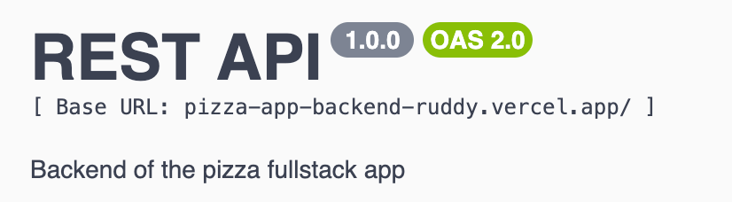
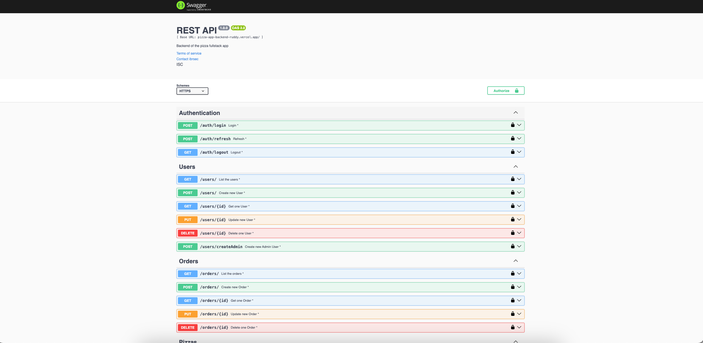

 


<a name="readme-top"></a>
 
 
<!-- PROJECT LOGO -->
<br />
<div align="center">
   
  <a href="https://pizza-app-backend-ruddy.vercel.app/documents/swagger/">
    
  </a>

  <h3 align="center">Pizza App backend</h3>

  <p align="center">
    An awesome Pizza App Backend
    <a href="https://github.com/ibrsec/pizza-app-backend"><strong>Explore the docs »</strong></a>
    <br />
    <br />
    <a href="https://pizza-app-backend-ruddy.vercel.app/documents/swagger/">Backend Swagger</a>
    ·
    <a href="https://pizza-app-backend-ruddy.vercel.app/documents/redoc">Backend Re-doc</a>
    ·
    <a href="https://github.com/ibrsec/pizza-app-backend/issues">Report Bug</a>
    ·
    <a href="https://github.com/ibrsec/pizza-app-backend/issues">Request Feature</a>
  </p>
</div>


<!-- TABLE OF CONTENTS -->
<details>
  <summary>📎 Table of Contents 📎 </summary>
  <ol>
    <li><a href="#about-the-project">About The Project</a></li>
    <li><a href="#erd">ERD</a></li>
     <!-- <li><a href="#figma">Figma</a></li> -->
     <li><a href="#overview">Overview</a></li>
     <li><a href="#quick-setup">Quick Setup</a></li>
     <li><a href="#directory-structure">Directory structure</a></li>
     <li><a href="#built-with">Built With</a></li>
    <!-- <li>
      <a href="#getting-started">Getting Started</a>
      <ul>
        <li><a href="#prerequisites">Prerequisites</a></li>
        <li><a href="#installation">Installation</a></li>
      </ul>
    </li>
    <li><a href="#usage">Usage</a></li>
    <li><a href="#roadmap">Roadmap</a></li>
    <li><a href="#contributing">Contributing</a></li>
    <li><a href="#license">License</a></li>
    <li><a href="#contact">Contact</a></li>
    <li><a href="#acknowledgments">Acknowledgments</a></li> -->

    
  </ol>
</details>


---
 
<!-- ABOUT THE PROJECT -->
<a name="about-the-project"></a>
## ℹ️ About The Project
 
[](https://pizza-app-backend-ruddy.vercel.app/documents/swagger/)

<!-- ERD OF THE PROJECT -->
<a name="erd"></a>
## ℹ️ ERD
[](https://pizza-app-backend-ruddy.vercel.app/documents/swagger/)


<p align="right">(<a href="#readme-top">back to top</a>)</p>


---

<!-- ## Figma 

<a href="https://www.figma.com/file/ePyCHKsx2ODB32uLgyUEEd/bootstrap-home-page?type=design&node-id=0%3A1&mode=design&t=edDzadCB9Ev5FS1a-1">Figma Link</a>  

  <p align="right">(<a href="#readme-top">back to top</a>)</p>


--- -->
<a name="overview"></a>
## 👀 Overview

<b>🎯 Express.js Framework:</b> Developed a RESTful API using Express.js to manage pizza orders, user data, and menu functionalities with secure routes and efficient processing.</br>

<b>📊 Database Management:</b> Utilized MongoDB and Mongoose for data modeling, validation, and querying, supporting complex relationships between pizzas, toppings, orders, and users.</br>

<b>🔄 CRUD Operations:</b> Implemented full CRUD functionality for pizzas, toppings, orders, and users, ensuring secure and seamless data operations for both admins and customers.</br>

<b>🛠 Middleware & Error Handling:</b> Integrated custom middleware for authentication, input validation, CORS handling, and error management using express-async-errors.</br>

<b>🔍 Advanced Features:</b> Added searching, sorting, and pagination capabilities to enhance data retrieval and management in list views for pizzas and orders.</br>

<b>📜 API Documentation:</b> Employed Swagger and Redoc for comprehensive API documentation, facilitating easy integration and testing.</br>

<b>🌐 Scalable Deployment:</b> Prepared the application for deployment on platforms like Vercel to ensure scalability and high availability.</br>


<!-- 💪 -</br> -->
<!-- 🌱 -</br> -->
 <!-- 🐞 ---  </br> -->
<!-- 🏀 --- </br> -->
<!-- 🌱  ---</br>   -->
</br>


<p align="right">(<a href="#readme-top">back to top</a>)</p>


<a name="quick-setup"></a>
## 🛫 Quick Setup

```sh
# clone the project
git clone https://github.com/ibrsec/pizza-app-backend.git

# enter the project directory
cd pizza-app-backend

# install dependency
npm install 

# develop
npm run start 
```

<p align="right">(<a href="#readme-top">back to top</a>)</p>


<!-- ## 🐞 Debug

 -->


<a name="directory-structure"></a>
## 📂 Directory structure 

```diff
+ pizza-app-backend  (folder)     
+     |---src (folder) 
      |     |---configs (folder)       
      |     |           
      |     |---controllers (folder) 
      |     |    
      |     |---middlewares (folder)      
      |     |          
      |     |---helpers (folder)      
      |     |          
      |     |---models (folder)           
      |     |          
      |     └---routes (folder)  
      |      
      |----.env
      |----.gitignore
      |----index.js
      |----package.json 
      |----swaggerAutogen.js 
      |----vercel.json
      └----readme.md 
```


<p align="right">(<a href="#readme-top">back to top</a>)</p>

---

<a name="built-with"></a>
### 🏗️ Built With

 
<!-- https://dev.to/envoy_/150-badges-for-github-pnk  search skills-->


  
 

  
  
  
  
  
  

<!-- swagger -->
  
  
  


  
  
  
  
 

  


 
<p align="right">(<a href="#readme-top">back to top</a>)</p>


